# Investigation Report
## BlueSky Ransomware — CyberDefenders

---

## Case Overview

| Field | Details |
|-------|---------|
| Case ID | CD-001 |
| Challenge | BlueSky Ransomware |
| Platform | CyberDefenders |
| Category | Network Forensics |
| Tool | Wireshark (BlueSkyRansomware.pcap) |
| Difficulty | Medium |
| Date | July 30, 2026 |
| Analyst | Nithin Avula |
| Total Packets | 4,797 |
| Status | **Closed — Fully Investigated** |

---

## Scenario

A security incident was reported involving a suspected ransomware attack on an internal Windows server. A network packet capture (PCAP) file was provided for forensic analysis. As the SOC analyst, the objective was to reconstruct the full attack chain — from initial reconnaissance through credential dumping and lateral movement — using Wireshark to analyze network traffic.

---

## Tools Used

| Tool | Purpose |
|------|---------|
| Wireshark | PCAP analysis and traffic inspection |
| TCP Stream Follow | Reconstruct attacker payloads |
| TDS Protocol Filter | Identify SQL Server activity |
| HTTP Filter | Extract downloaded scripts |
| CyberChef | Decode Base64 encoded commands |

---

## Network Participants

| Role | IP Address | Details |
|------|------------|---------|
| **Attacker / C2 Server** | 87.96.21.84 | Python SimpleHTTP server hosting payloads |
| **Victim Server** | 87.96.21.81 | Windows SQL Server — compromised target |

---

## Attack Timeline

| Time | Packet | Action | MITRE Technique |
|------|--------|--------|-----------------|
| 2.828s | 31-50 | Port scan on victim (Port 139, SMB) | T1046 |
| 19.790s | 2641 | TDS7 login to SQL Server (sa/cyb3rd3f3nd3r$) | T1078 |
| 19.795s | 2643 | xp_cmdshell enabled via SQL | T1505.001 |
| 136.853s | 4214 | checking.ps1 downloaded from C2 | T1059.001 |
| 136.856s | 4218 | Windows Defender disabled | T1562.001 |
| 136.856s | 4219 | Scheduled task created for persistence | T1053.005 |
| 139.384s | 4284 | Invoke-PowerDump.ps1 downloaded | T1003.002 |
| 147.618s | 4543 | ichigo-lite.ps1 downloaded | T1021.002 |
| 147.619s | 4547 | NTLM hashes extracted and sent to C2 | T1003.002 |

---

## Finding 1 — Initial Reconnaissance (Port Scanning)

**MITRE:** T1046 — Network Service Discovery
**Severity:** LOW
**Time:** Packet 31 — 2.828s

The attacker at **87.96.21.84** performed TCP port scanning against the victim at **87.96.21.81**. Multiple SYN packets were observed targeting port **139 (NetBIOS/SMB)**, indicating the attacker was identifying open services before launching the attack. RST/ACK responses confirmed the scan pattern.

**Key Evidence:**
- Source: 87.96.21.84 → Destination: 87.96.21.81
- Port 139 (NetBIOS) targeted
- Classic SYN scan pattern observed
- Multiple RST packets indicating port state detection

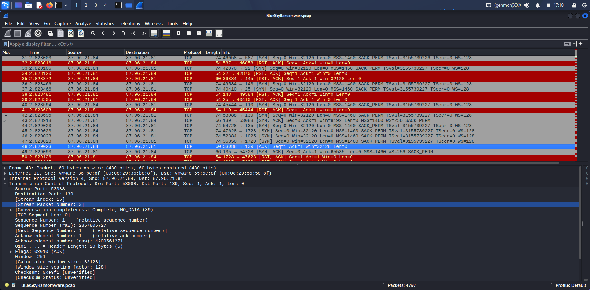

---

## Finding 2 — SQL Server Brute Force & Compromise

**MITRE:** T1078 — Valid Accounts (Default Credentials)
**Severity:** CRITICAL
**Time:** Packet 2641 — 19.790s

After identifying the open SQL Server port, the attacker authenticated to Microsoft SQL Server using the **default SA (System Administrator) account** with a weak password. The TDS (Tabular Data Stream) protocol revealed plaintext credentials in the network capture.

**Credentials Extracted:**
| Field | Value |
|-------|-------|
| Username | `sa` |
| Password | `cyb3rd3f3nd3r$` |
| Client Name | `sivVZ` |
| App Name | `oAygATwt` |
| Server | `87.96.21.81` |
| Database | `master` |

**Why critical:** The `sa` account has full SQL Server privileges. Compromising it gives the attacker complete database and OS-level control via xp_cmdshell.

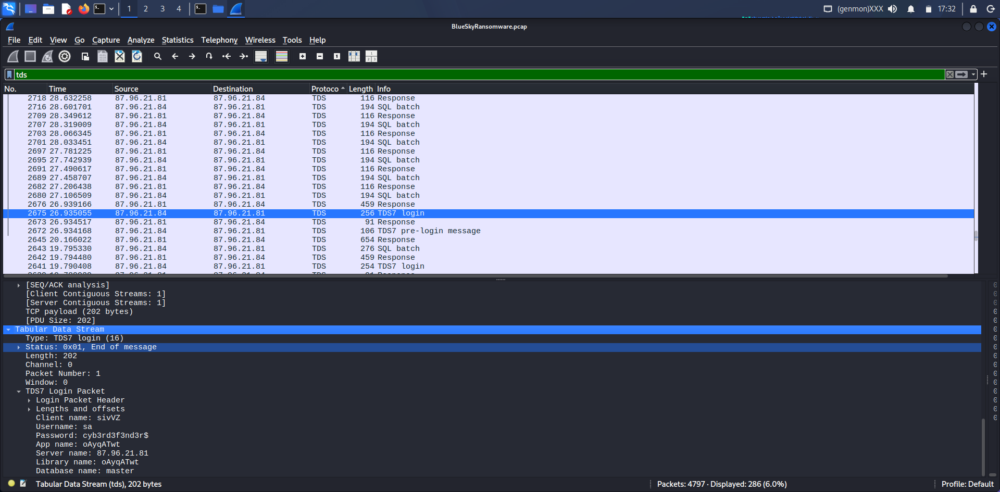

---

## Finding 3 — SQL Server Used as Attack Vector (xp_cmdshell)

**MITRE:** T1505.001 — SQL Stored Procedures
**Severity:** CRITICAL
**Time:** Packet 2643 — 19.795s

Immediately after login, the attacker executed SQL commands to enable `xp_cmdshell` — a dangerous SQL Server feature that allows execution of operating system commands directly from SQL queries. This effectively turned the SQL Server into a remote command execution engine.

**SQL Commands Observed:**
```sql
EXEC sp_configure 'show advanced options', 1;
RECONFIGURE;
EXEC sp_configure 'xp_cmdshell', 1;
RECONFIGURE;
```

**Why critical:** xp_cmdshell gives an attacker full OS-level command execution with SQL Server service account privileges — typically running as SYSTEM or Administrator.

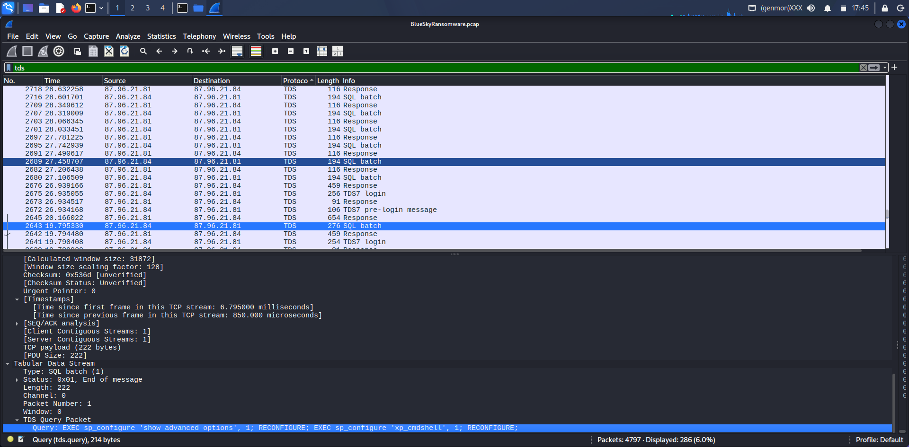

---

## Finding 4 — Malicious PowerShell Script Downloaded (checking.ps1)

**MITRE:** T1059.001 — PowerShell
**Severity:** HIGH
**Time:** Packet 4214 — 136.853s

The attacker used xp_cmdshell to download a PowerShell script named `checking.ps1` from their Python HTTP server at 87.96.21.84. The script performed privilege checks and system reconnaissance before proceeding with the attack chain.

**Script Analysis:**
| Function | Purpose |
|----------|---------|
| `$priv` check | Verifies if running as Administrator (S-1-5-32-544) |
| `$osver` check | Gets Windows major version number |
| `Test-URL` | Tests connectivity to C2 server |
| `Test-ScriptURL` | Verifies scripts are reachable on C2 |
| `$url = "http://87.96.21.84"` | C2 server hardcoded in script |

**Server Details:**
- Server: `SimpleHTTP/0.6 Python/3.11.8`
- Date: Sun, 28 Apr 2024 00:32:10 GMT
- Content-Length: 5024 bytes

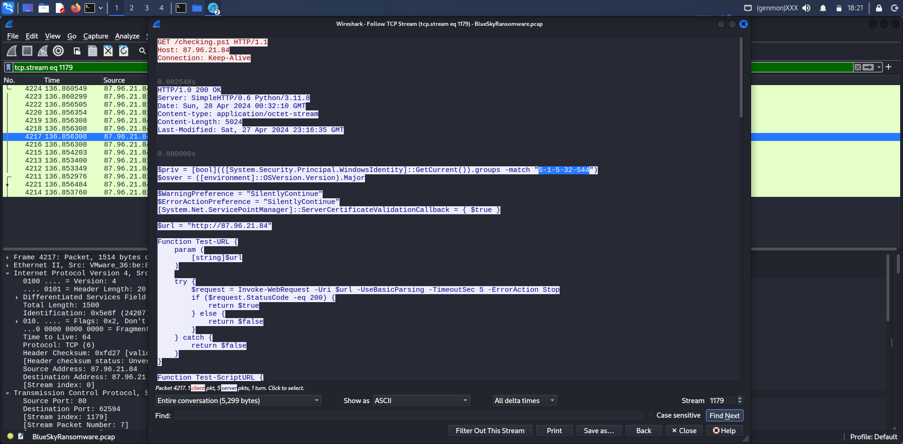

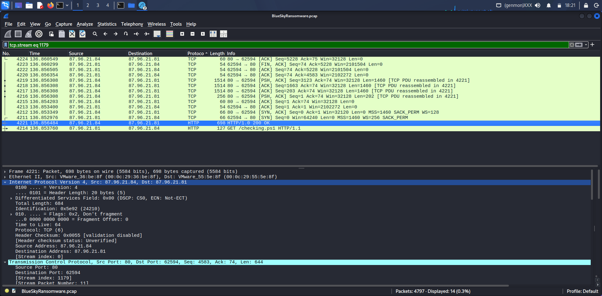

---

## Finding 5 — Defense Evasion (Windows Defender Disabled)

**MITRE:** T1562.001 — Disable or Modify Tools
**Severity:** CRITICAL
**Time:** Packet 4218 — 136.856s

The `checking.ps1` script contained a `Disable-WindowsDefender` function that systematically disabled all Windows security features before proceeding with the ransomware deployment. This is a classic defense evasion technique to prevent detection.

**Actions Taken by Attacker:**
```
Set-MpPreference -DisableRealtimeMonitoring $true
Set-MpPreference -ExclusionPath "C:\ProgramData\Oracle"
Set-MpPreference -ExclusionPath "C:\ProgramData\Oracle\Java"
Set-MpPreference -ExclusionPath "C:\Windows"
```

**Registry Keys Modified:**
- `DisableAntiSpyware`
- `DisableRoutinelyTakingAction`
- `DisableRealtimeMonitoring`
- `SubmitSamplesConsent`
- `SpynetReporting`

**Security Services Stopped:**
- WinDefend (Windows Defender)
- MBAMService (Malwarebytes)
- MBAMProtection
- Sophos antivirus services

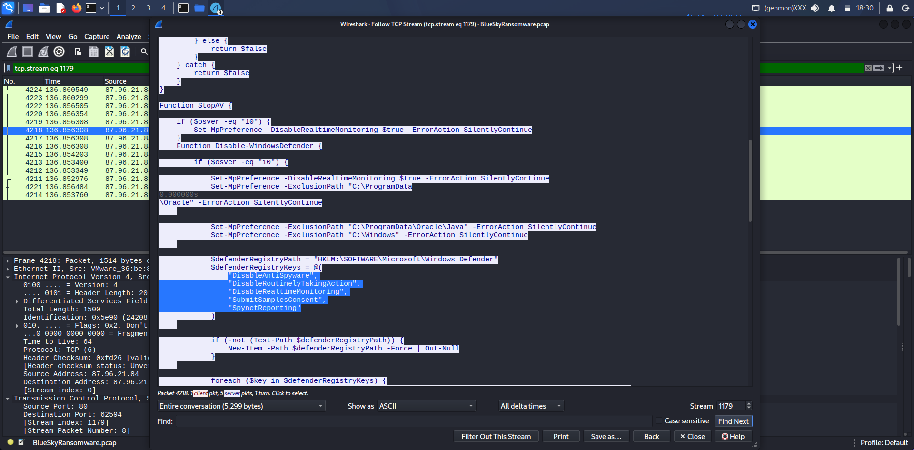

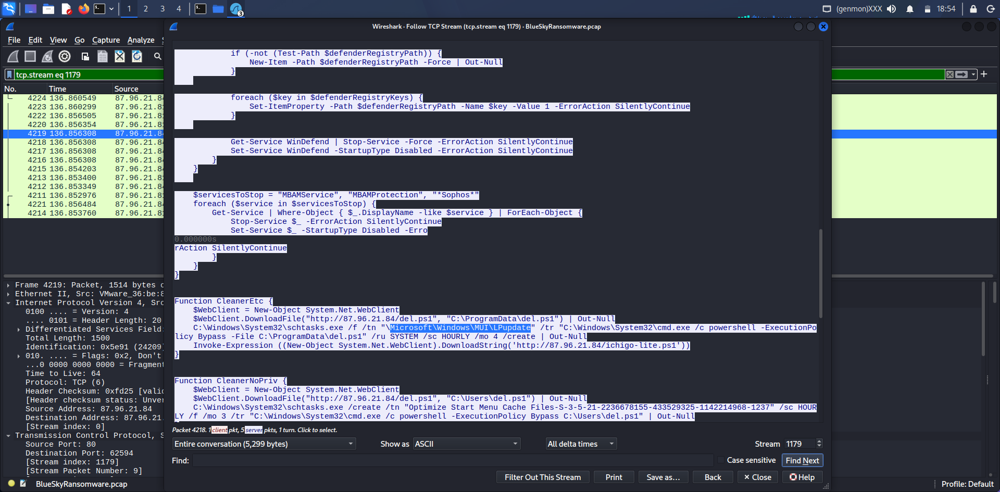

---

## Finding 6 — Persistence Mechanism (Scheduled Task)

**MITRE:** T1053.005 — Scheduled Task
**Severity:** HIGH
**Time:** Packet 4219 — 136.856s

The attacker created a scheduled task disguised as a legitimate Windows maintenance task to ensure persistent access and automatic execution of malicious scripts after reboot.

**Scheduled Task Details:**
```
Task Name: "Optimize Start Menu Cache Files-S-3-5-21-
            2236678155-433529325-1142214968-1237"
Schedule:  HOURLY
Command:   cmd.exe /c powershell -ExecutionPolicy 
           Bypass C:\Users\del.ps1
```

**Additional Scripts Downloaded for Persistence:**
- `http://87.96.21.84/del.ps1` → saved to `C:\ProgramData\del.ps1`
- `http://87.96.21.84/ichigo-lite.ps1` → lateral movement script

**Why concerning:** Task name mimics legitimate Windows task names to avoid detection during manual inspection.

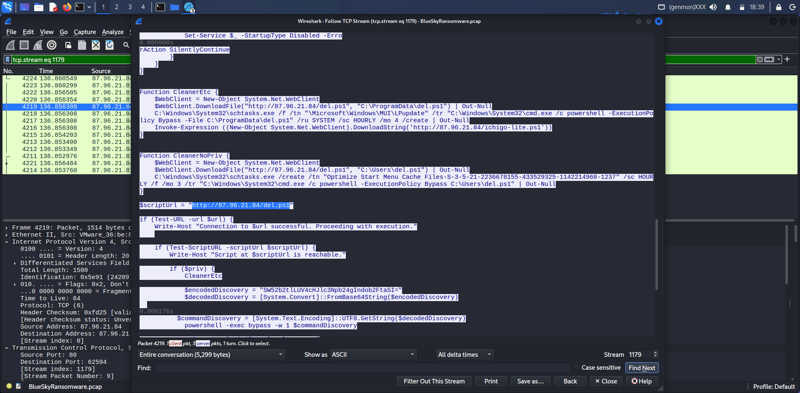

---

## Finding 7 — Credential Dumping (Invoke-PowerDump)

**MITRE:** T1003.002 — Security Account Manager
**Severity:** CRITICAL
**Time:** Packet 4284 — 139.384s

The attacker downloaded `Invoke-PowerDump.ps1` — a well-known credential dumping tool from darkoperator's Posh-SecMod toolkit — to extract NTLM password hashes from the Windows registry (SAM database).

**Tool Details:**
```
Script: Invoke-PowerDump.ps1
Source: darkoperator's Posh-SecMod
URL: http://87.96.21.84/Invoke-PowerDump.ps1
Authors: Kathy Peters, Josh Kelley (winfang),
         Dave Kennedy (ReL1K)
```

**NTLM Hashes Extracted (visible in PCAP):**
| Account | Hash (partial) |
|---------|----------------|
| Administrator | aad3b435b51404ee... |
| Guest | aad3b435b51404ee... |
| Carlos | aad3b435b51404ee... |
| HomeGroupUser$ | aad3b435b51404ee... |

**Impact:** Extracted hashes can be used for Pass-the-Hash attacks to authenticate to other systems without knowing plaintext passwords.

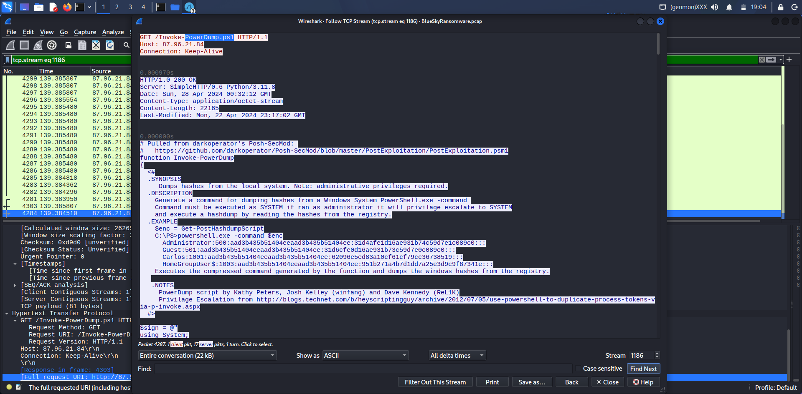

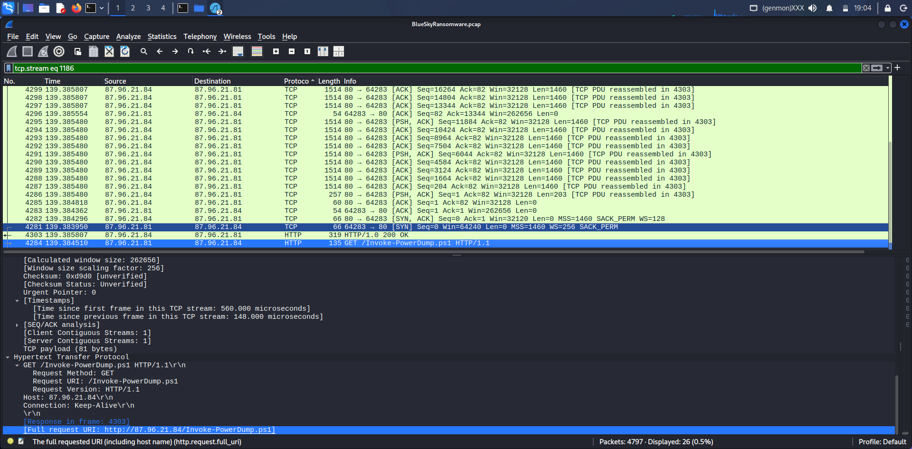

---

## Finding 8 — Lateral Movement (SMBExec)

**MITRE:** T1021.002 — SMB/Windows Admin Shares
**Severity:** CRITICAL
**Time:** Packet 4543 — 147.618s

The final stage of the attack involved downloading `ichigo-lite.ps1` which loaded both `Invoke-PowerDump.ps1` and `Invoke-SMBExec.ps1` to perform lateral movement using the extracted password hashes.

**Attack Flow in ichigo-lite.ps1:**
```
1. Download Invoke-PowerDump.ps1
2. Download Invoke-SMBExec.ps1
3. Read extracted hosts: extracted_hosts.txt
4. Read hashes: C:\ProgramData\hashes.txt
5. Decode encoded commands (Base64)
6. Execute SMBExec against remote hosts
7. Lateral movement to other systems
```

**Encoded Command Found:**
```
$EncodedCommand = "KE51dy1PYmp1Y3QgU3lzdGVtdC5YZWJDbGlbnQpLkRvd25sb2FkU3RyaW5nKCdodHRwOi8v..."
```
Decoded reveals additional C2 communication and payload execution commands.

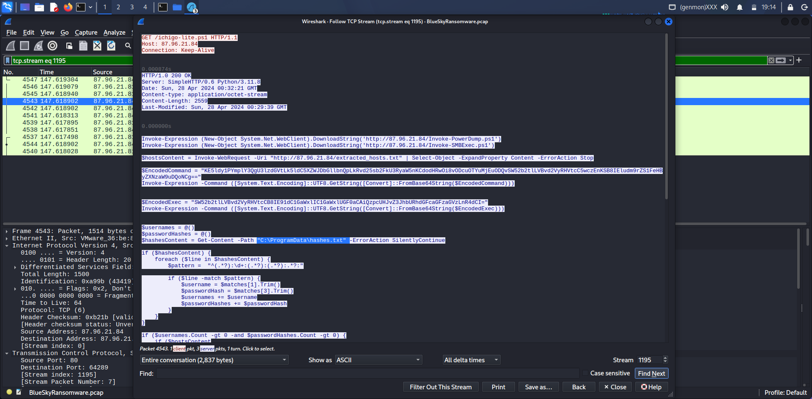

---

## Full Attack Chain Reconstructed

```
PHASE 1: RECONNAISSANCE
87.96.21.84 scans 87.96.21.81
Port 139 (SMB/NetBIOS) identified
         ↓
PHASE 2: INITIAL ACCESS
SQL Server login with sa/cyb3rd3f3nd3r$
xp_cmdshell enabled for OS execution
         ↓
PHASE 3: EXECUTION
checking.ps1 downloaded via HTTP
PowerShell execution begins
Admin privileges confirmed
         ↓
PHASE 4: DEFENSE EVASION
Windows Defender completely disabled
Registry keys modified
AV services (MBAM, Sophos) stopped
         ↓
PHASE 5: PERSISTENCE
Scheduled task created (hourly)
del.ps1 downloaded for persistence
         ↓
PHASE 6: CREDENTIAL ACCESS
Invoke-PowerDump.ps1 downloaded
NTLM hashes extracted from SAM
Hashes saved to C:\ProgramData\hashes.txt
         ↓
PHASE 7: LATERAL MOVEMENT
ichigo-lite.ps1 downloaded
Invoke-SMBExec.ps1 loaded
Pass-the-Hash attack on network hosts
```

---

## IOCs (Indicators of Compromise)

| IOC | Type | Description |
|-----|------|-------------|
| `87.96.21.84` | IP Address | Attacker C2 server |
| `87.96.21.81` | IP Address | Victim SQL server |
| `cyb3rd3f3nd3r$` | Credential | Compromised SA password |
| `sivVZ` | Hostname | Attacker client hostname |
| `http://87.96.21.84/checking.ps1` | URL | Initial PowerShell payload |
| `http://87.96.21.84/del.ps1` | URL | Persistence script |
| `http://87.96.21.84/Invoke-PowerDump.ps1` | URL | Credential dumper |
| `http://87.96.21.84/Invoke-SMBExec.ps1` | URL | Lateral movement tool |
| `http://87.96.21.84/ichigo-lite.ps1` | URL | Orchestration script |
| `C:\ProgramData\hashes.txt` | File Path | Extracted NTLM hashes |
| `C:\ProgramData\del.ps1` | File Path | Persistence script location |
| `SimpleHTTP/0.6 Python/3.11.8` | Server | C2 server type |

---

## MITRE ATT&CK Mapping

| Tactic | Technique | ID | Evidence |
|--------|-----------|-----|---------|
| Reconnaissance | Network Service Discovery | T1046 | Port 139 scanning |
| Initial Access | Valid Accounts | T1078 | SA login with default creds |
| Execution | SQL Stored Procedures | T1505.001 | xp_cmdshell enabled |
| Execution | PowerShell | T1059.001 | checking.ps1, del.ps1 |
| Persistence | Scheduled Task | T1053.005 | Hourly task created |
| Defense Evasion | Disable Security Tools | T1562.001 | Defender disabled |
| Credential Access | Security Account Manager | T1003.002 | Invoke-PowerDump |
| Lateral Movement | SMB/Windows Admin Shares | T1021.002 | Invoke-SMBExec |
| Command & Control | Web Protocols | T1071.001 | HTTP C2 traffic |

---

## Conclusion

The BlueSky ransomware attack followed a sophisticated multi-stage intrusion chain. The attacker exploited a poorly secured Microsoft SQL Server with the default `sa` account and a weak password (`cyb3rd3f3nd3r$`). Using `xp_cmdshell` as the initial foothold, the attacker executed a PowerShell-based attack chain that systematically disabled all security controls, established persistence via scheduled tasks, dumped NTLM credential hashes, and finally leveraged Pass-the-Hash attacks with `Invoke-SMBExec` for lateral movement across the network.

The entire attack was conducted over an HTTP channel using a Python SimpleHTTP server, making all payloads visible in plaintext within the PCAP capture — a significant operational security failure by the attacker that aided forensic analysis.

---

## Recommendations

| Priority | Action | Addresses |
|----------|--------|-----------|
| CRITICAL | Disable SA account or enforce strong password policy | T1078 |
| CRITICAL | Disable xp_cmdshell on all SQL Server instances | T1505.001 |
| CRITICAL | Block outbound HTTP to unknown IPs at firewall | T1071.001 |
| HIGH | Enable PowerShell Script Block Logging | T1059.001 |
| HIGH | Monitor scheduled task creation events (Event ID 4698) | T1053.005 |
| HIGH | Deploy Credential Guard to protect NTLM hashes | T1003.002 |
| MEDIUM | Implement network segmentation to limit SMB lateral movement | T1021.002 |
| MEDIUM | Deploy SIEM rule for xp_cmdshell enable events | T1505.001 |
| MEDIUM | Block Python SimpleHTTP server signatures at perimeter | T1071.001 |

---

## Lessons Learned

1. **Default credentials are the easiest entry point** — The SA account with a weak password gave the attacker full system access within seconds. Strong password policies and disabling unused accounts are fundamental controls.

2. **xp_cmdshell should always be disabled** — This feature transforms a database server into a remote command execution platform. It should be disabled by default and audited regularly.

3. **Defense evasion precedes every stage** — The attacker disabled all security tools before executing any malicious payload. This highlights the need for tamper-proof security monitoring that cannot be disabled by local commands.

4. **NTLM hashes enable password-less attacks** — Extracting hashes allows lateral movement without ever knowing plaintext passwords. Credential Guard and network segmentation are essential mitigations.

5. **Plaintext HTTP C2 is detectable** — The attacker used unencrypted HTTP for all payload delivery, making the entire attack chain visible in network captures. TLS inspection and network monitoring would catch this in real time.

6. **Scheduled tasks are a classic persistence mechanism** — Disguising malicious tasks with legitimate-sounding names is a common technique. Baselining all scheduled tasks and alerting on new creations is essential SOC practice.

---

*Report prepared by: Nithin Avula*
*Platform: CyberDefenders — BlueSky Ransomware Challenge*
*GitHub: github.com/Nithin-099*
