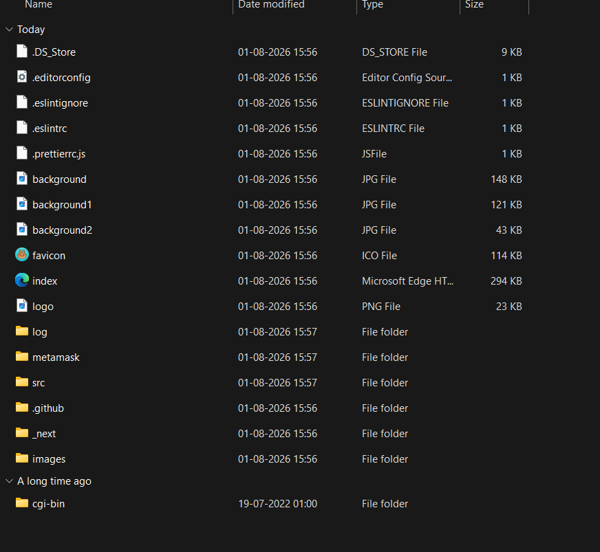
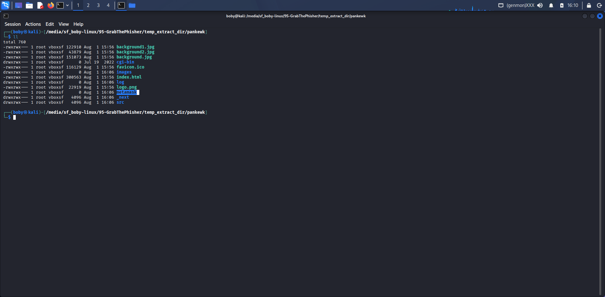
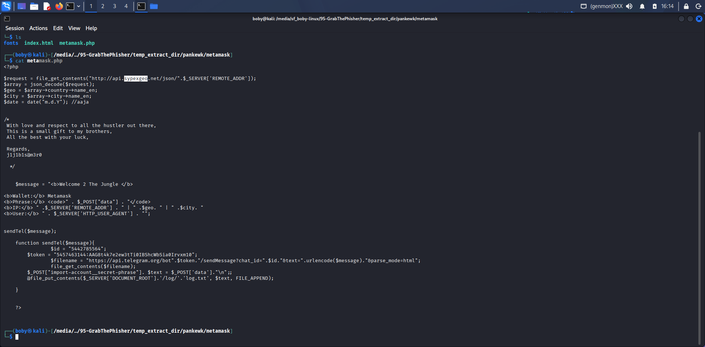
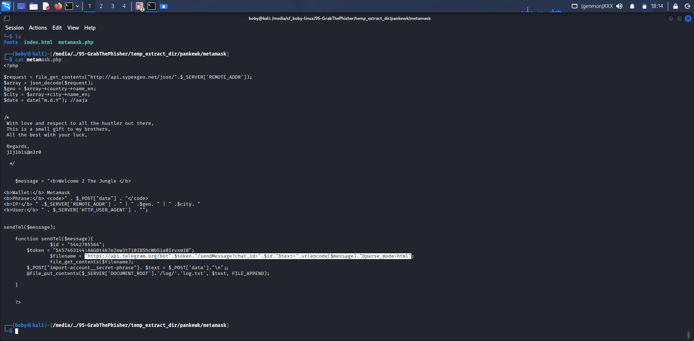
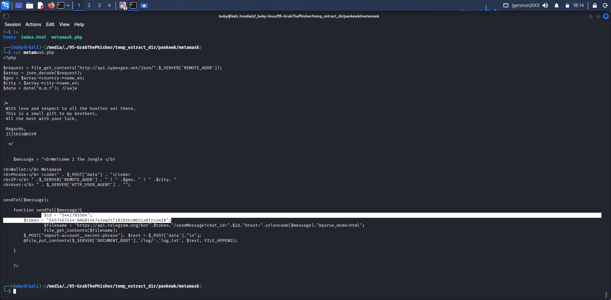
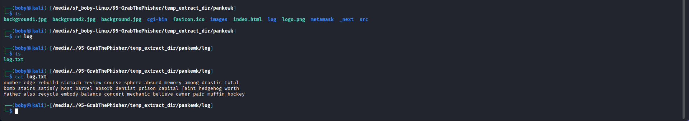
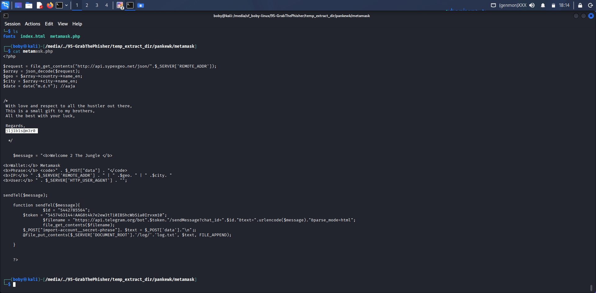

# Investigation Report
## GrabThePhisher — CyberDefenders

### Case Overview
| Field | Details |
|-------|---------|
| Case ID | CD-002 |
| Challenge | GrabThePhisher |
| Platform | CyberDefenders |
| Category | Phishing Kit Analysis |
| Difficulty | Medium |
| Date | August, 2026 |
| Analyst | Nithin Avula |
| Status | Closed — Resolved |

---

### Scenario
A phishing kit was discovered on a
compromised web server targeting
cryptocurrency wallet users.
As SOC analyst, investigate the kit
to identify attacker infrastructure,
methodology, stolen credentials,
and threat actor identity.

---

### Tools Used
| Tool | Purpose |
|------|---------|
| VS Code | PHP/HTML file analysis |
| Linux Terminal | File enumeration |
| CyberChef | String decoding |
| VirusTotal | IOC reputation check |
| Telegram API | Bot verification |

---

### File Structure Analysis

| File/Folder | Type | Significance |
|-------------|------|--------------|
| index.html | HTML | Fake MetaMask page |
| metamask/ | Folder | Phishing kit core |
| log/ | Folder | Stolen credentials |
| src/ | Folder | Source code |
| cgi-bin/ | Folder | Backend scripts |
| background.jpg | Image | Fake site asset |
| logo.png | Image | Stolen MetaMask logo |

---

### Finding 1 — Phishing Target Identified
**What:** MetaMask cryptocurrency wallet
**Why significant:**
MetaMask holds Ethereum and ERC-20
tokens. Stealing seed phrase gives
attacker complete wallet access —
all funds can be drained instantly.
This is irreversible — no bank can
reverse crypto theft.

---

### Finding 2 — GEO VERSION
**Version:** [Sypex Geo]
**Why significant:**
Knowing service does the kit use to retrieve the victim's machine information helps:
→ Gets victim country and city
→ Attack’s sophistication 
→ Track kit across other servers

---

### Finding 3 — Data Exfiltration Method
**Service:** "/api.telegram.org/bot"
**Why significant:**
Attackers increasingly use Telegram
instead of email because:
→ Harder to track than email
→ Real-time notifications
→ Encrypted communications
→ Anonymous account creation
→ No server infrastructure needed

---

### Finding 4 — Attacker Infrastructure
**Bot Token:** ["5457463144:AAG8t4k7e2ew3tTi0IBShcWbSia0Irvxm10"]
**Chat ID:** ["5442785564"]

**Verification steps taken:**
Telegram bot token format verified:
[bot_id]:[random_string]
This confirms active Telegram bot
used for real-time data theft.

---

### Finding 5 — Stolen Credentials
**Seed phrases collected:** [12/24 words]
**Impact assessment:**
Each seed phrase =
complete cryptocurrency wallet access.
[3] victims potentially
had their wallets compromised.
Average MetaMask wallet value
makes this a significant financial crime.

---

### Finding 6 — Threat Actor Identity
**Alias:** [j1j1b1s@m3r0]
**Why significant:**
Developer alias found in kit code
→ Can be used for threat attribution
→ May match known threat actor
→ Useful for law enforcement
→ Can track same actor across
   other phishing campaigns

---

### IOCs Discovered
| IOC | Type | Verdict |
|-----|------|---------|
| [5457463144:AAG8t4k7e2ew3tTi0IBShcWbSia0Irvxm10] | Bot Token | Malicious |
| ["5442785564"] | Telegram ID | Malicious |
| [j1j1b1s@m3r0] | Threat Actor | Attribution |
| [PHP] | Technology | Intelligence |

---

### Attack Flow Reconstructed

Victim receives phishing link
↓
Clicks → Lands on fake MetaMask page
↓
Enters seed phrase (12/24 words)
↓
PHP script captures input
↓
Telegram Bot API sends data
↓
Attacker receives in real time
↓
Wallet drained immediately

---

### MITRE ATT&CK Mapping
| Tactic | Technique | ID | Evidence |
|--------|-----------|-----|---------|
| Initial Access | Phishing | T1566 | Fake MetaMask site |
| Credential Access | Credentials from Web | T1056 | Seed phrase form |
| Command & Control | Web Service | T1102 | Telegram Bot API |
| Collection | Input Capture | T1056.003 | PHP form capture |

---

### Conclusion
A sophisticated MetaMask phishing kit
was deployed targeting cryptocurrency
users. The attacker used Telegram Bot
API for real-time credential harvesting,
collecting [12/24] seed phrases.
The threat actor alias [j1j1b1s@m3r0] was
identified in the kit source code,
providing attribution opportunity.

---

### Recommendations
1. Block Telegram bot token immediately
2. Report bot to Telegram abuse team
3. Notify [number] victims to transfer
   funds to new wallets immediately
4. Take down phishing domain
5. Alert cryptocurrency community
6. Submit IOCs to threat intel feeds

---

### Lessons Learned
1. Telegram increasingly used as C2
   for phishing kits — monitor for
   Telegram API calls in web traffic
2. Crypto phishing kits target seed
   phrases — train users never to
   enter seed phrase on any website
3. Developer aliases in kit code
   enable threat actor attribution
   across multiple campaigns
4. PHP-based kits are simple but
   effective — focus on user education
   alongside technical controls