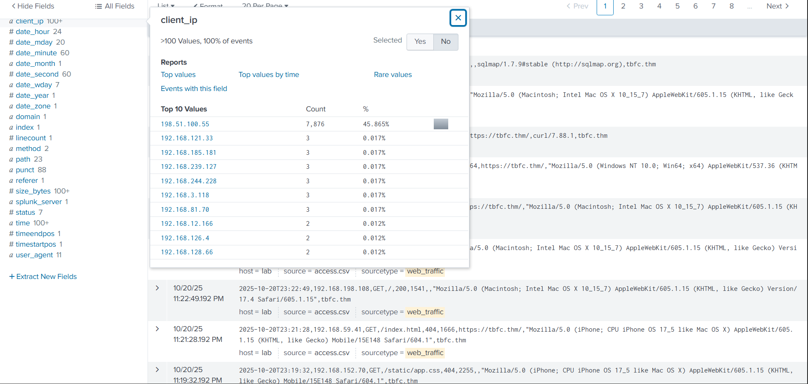
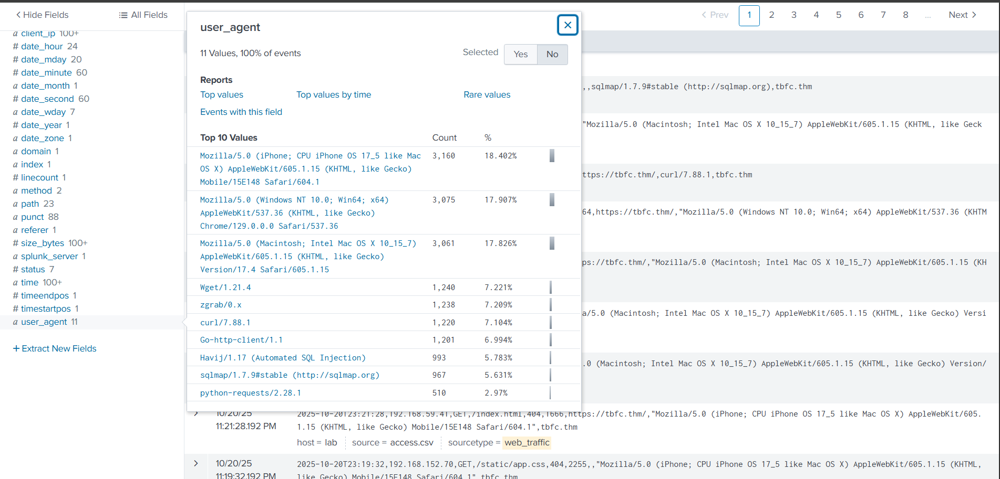
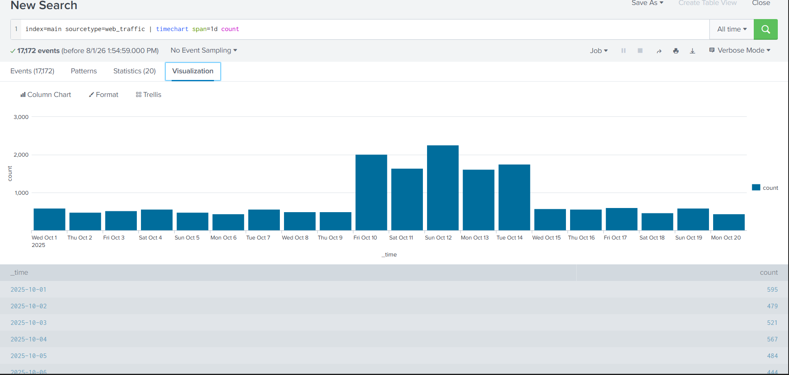
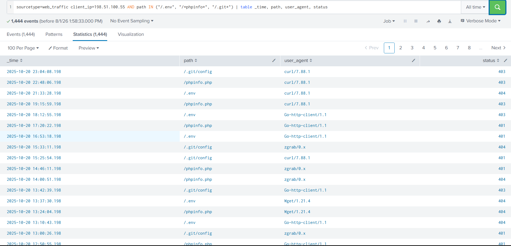
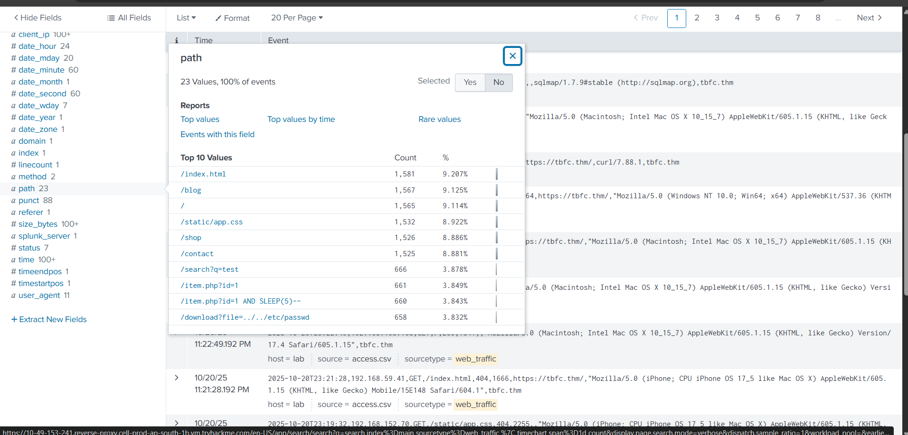
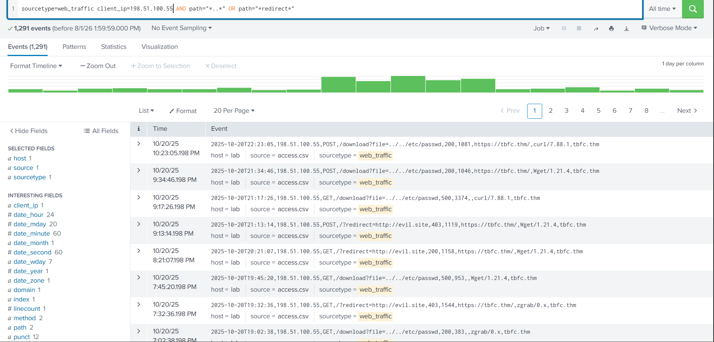
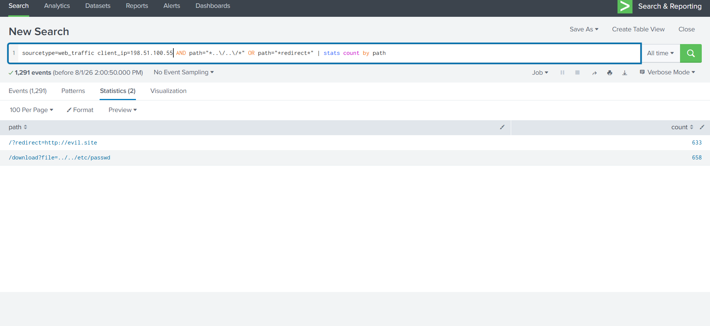
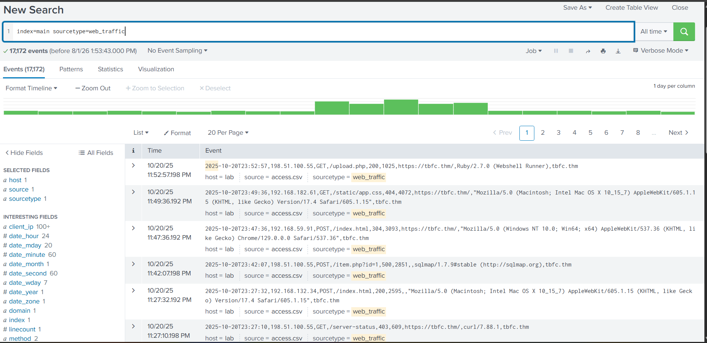
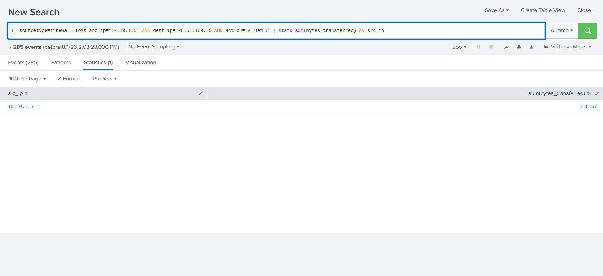

# Investigation Report
## Investigating With Splunk — TryHackMe

---

## Case Overview

| Field | Details |
|-------|---------|
| Case ID | THM-SPL-001 |
| Room | Investigating with Splunk |
| Platform | TryHackMe |
| Tool | Splunk Enterprise 8.2 |
| Log Sources | web_traffic, firewall_logs |
| Total Events | 17,172 web traffic events |
| Date | August 01, 2026 |
| Analyst | Nithin Avula |
| Status | **Closed — Fully Investigated** |

---

## Scenario

A web server hosted at **tbfc.thm** reported suspicious activity. As the SOC analyst, web traffic and firewall logs were ingested into Splunk Enterprise for analysis. The objective was to identify the attacker, determine the attack techniques used, find evidence of compromise, and assess the impact including any data exfiltration.

---

## Tools & SPL Queries Used

| SPL Query | Purpose |
|-----------|---------|
| `index=main sourcetype=web_traffic` | Load all web traffic logs |
| `index=main sourcetype=web_traffic \| timechart span=1d count` | Visualize attack timeline |
| `sourcetype=web_traffic client_ip=198.51.100.55 AND path IN ("/.env","/*phpinfo*","/.git*") \| table _time, path, user_agent, status` | Find recon activity |
| `sourcetype=web_traffic client_ip=198.51.100.55 AND path="*..*" OR path="*redirect*"` | Find traversal and redirect attacks |
| `sourcetype=web_traffic client_ip=198.51.100.55 AND path="*..\/\.\/*" OR path="*redirect*" \| stats count by path` | Count attack types |
| `sourcetype=firewall_logs src_ip="10.10.1.5" AND dest_ip=198.51.100.55 AND action="ALLOWED" \| table _time, action, protocol, src_ip, dest_ip, dest_port, reason` | Find C2 communication |
| `sourcetype=firewall_logs src_ip="10.10.1.5" AND dest_ip=198.51.100.55 AND action="ALLOWED" \| stats sum(bytes_transferred) by src_ip` | Calculate data exfiltrated |

---

## Network Participants

| Role | IP Address | Details |
|------|------------|---------|
| **Attacker** | 198.51.100.55 | 7,876 events — 45.8% of all traffic |
| **Victim Web Server** | tbfc.thm | Target of web attacks |
| **Compromised Internal Host** | 10.10.1.5 | C2 beacon — 285 connections to attacker |

---

## Attack Timeline

| Date | Events | Activity |
|------|--------|---------|
| Oct 01-09, 2025 | ~500/day | Low baseline — initial recon |
| Oct 10, 2025 | ~2,000 | **Attack escalation begins** |
| Oct 11, 2025 | ~1,700 | Continued heavy scanning |
| Oct 12, 2025 | ~2,400 | **Peak attack day** |
| Oct 13, 2025 | ~1,700 | Exploitation phase |
| Oct 14, 2025 | ~1,800 | Post-exploitation activity |
| Oct 15-20, 2025 | ~700/day | C2 communication + data theft |

---

## Finding 1 — Attacker Identified (Primary IP)

**MITRE:** T1190 — Exploit Public-Facing Application
**Severity:** CRITICAL

The attacker IP **198.51.100.55** was responsible for **7,876 events** — accounting for **45.865% of ALL web traffic** during the investigation period. This single IP dominated traffic, making it immediately suspicious during initial Splunk analysis.

**SPL Query Used:**
```
index=main sourcetype=web_traffic
```
Field analysis on `client_ip` revealed 198.51.100.55 as top value by massive margin.



---

## Finding 2 — Malicious User Agents (Attack Tools Identified)

**MITRE:** T1595 — Active Scanning
**Severity:** HIGH

Analysis of the `user_agent` field revealed **11 distinct values** with multiple automated attack tools used by the attacker. This confirms the attack was conducted using a combination of scanning, exploitation, and enumeration tools.

**Malicious User Agents Found:**

| User Agent | Events | Purpose |
|------------|--------|---------|
| `Wget/1.21.4` | 1,240 | File download tool — used for LFI extraction |
| `zgrab/0.x` | 1,238 | Network scanner — port/service enumeration |
| `curl/7.88.1` | 1,220 | HTTP tool — used for recon and data extraction |
| `Go-http-client/1.1` | 1,201 | Automated HTTP client — custom attack scripts |
| `Havij/1.17 (Automated SQL Injection)` | 993 | **SQL injection tool** — automated SQLi attacks |
| `sqlmap/1.7.9#stable` | 967 | **SQL injection framework** — database exploitation |
| `Ruby/2.7.0 (Webshell Runner)` | 1 | **Webshell execution** — confirmed compromise |
| `python-requests/2.28.1` | 510 | Python attack scripts |

**Key Finding:** The `Ruby/2.7.0 (Webshell Runner)` user agent confirms a webshell was successfully uploaded and executed on the victim server.



---

## Finding 3 — Traffic Volume & Attack Spike Timeline

**MITRE:** T1595.002 — Vulnerability Scanning
**Severity:** MEDIUM

The timechart visualization revealed a clear attack pattern — traffic spiked dramatically from October 10-14, 2025, indicating an organized multi-day attack campaign rather than opportunistic scanning.

**SPL Query Used:**
```
index=main sourcetype=web_traffic | timechart span=1d count
```

**Timeline Pattern:**
- **Oct 1-9:** Low baseline traffic (~500 events/day) — passive recon
- **Oct 10:** Sudden spike to ~2,000 events — attack begins
- **Oct 12:** Peak attack day ~2,400 events — exploitation phase
- **Oct 15+:** Reduced but persistent traffic — post-exploitation



---

## Finding 4 — Reconnaissance Activity (Sensitive File Probing)

**MITRE:** T1083 — File and Directory Discovery
**Severity:** HIGH

The attacker systematically probed for sensitive files and server information using automated tools. 1,444 events were identified targeting `.env`, `.git/config`, and `phpinfo.php` — all classic reconnaissance targets.

**SPL Query Used:**
```
sourcetype=web_traffic client_ip=198.51.100.55
AND path IN ("/.env", "/*phpinfo*", "/.git*")
| table _time, path, user_agent, status
```

**Sensitive Paths Targeted:**

| Path | Purpose | Tools Used |
|------|---------|------------|
| `/.env` | Environment variables (DB passwords, API keys) | curl, Go-http-client, Wget |
| `/phpinfo.php` | PHP server configuration disclosure | curl, zgrab, Wget |
| `/.git/config` | Source code repository access | curl, zgrab, Go-http-client |

**Impact:** If `.env` was accessible, database credentials and API keys would be exposed. If `.git/config` was accessible, full source code could be downloaded.



---

## Finding 5 — SQL Injection Attacks

**MITRE:** T1190 — Exploit Public-Facing Application
**Severity:** CRITICAL

Multiple SQL injection techniques were detected in the path analysis. The attacker used both manual payloads and automated tools (sqlmap, Havij) to attempt database exploitation.

**SQLi Payloads Found in Traffic:**

| Path | Technique | Description |
|------|-----------|-------------|
| `/item.php?id=1` | Basic SQLi test | Initial parameter testing |
| `/item.php?id=1 AND SLEEP(5)--` | Time-based blind SQLi | Database fingerprinting |
| `/search?q=test` | Input field testing | Search parameter SQLi attempt |

**Tools Used:** `sqlmap/1.7.9` (967 events) + `Havij/1.17` (993 events)


---

## Finding 6 — Local File Inclusion (LFI) & Open Redirect Attacks

**MITRE:** T1055 — Path Traversal / T1598 — Open Redirect
**Severity:** CRITICAL

Two critical web vulnerabilities were actively exploited — Local File Inclusion (LFI) allowing server file access and Open Redirect for phishing/malware distribution.

**SPL Query Used:**
```
sourcetype=web_traffic client_ip=198.51.100.55
AND path="*..*" OR path="*redirect*"
| stats count by path
```

**Attack Results:**

| Attack Type | Path | Count | Status | Impact |
|-------------|------|-------|--------|--------|
| **LFI** | `/download?file=../../etc/passwd` | **658** | 200 OK | **Linux password file accessed!** |
| **Open Redirect** | `/?redirect=http://evil.site` | **633** | 200 OK | Redirecting victims to attacker site |

**Critical Finding:** HTTP status **200 OK** on the LFI path confirms the `/etc/passwd` file was **successfully read** by the attacker — this is a confirmed exploitation, not just an attempt.





---

## Finding 7 — Webshell Upload & Execution Confirmed

**MITRE:** T1505.003 — Web Shell
**Severity:** CRITICAL

The most damning evidence — a **Webshell Runner** user agent was detected in the traffic logs. This confirms the attacker successfully uploaded a webshell to the server and executed commands through it.

**Evidence from SS3 (web traffic events):**
```
2025-10-20T23:52:57, 198.51.100.55, GET,
/upload.php, 200, 1025,
https://tbfc.thm/, Ruby/2.7.0 (Webshell Runner)
```

**Key Indicators:**
- Path: `/upload.php` — file upload endpoint used
- Status: `200 OK` — upload succeeded
- User Agent: `Ruby/2.7.0 (Webshell Runner)` — webshell executing
- This means the attacker had **full command execution** on the server



---

## Finding 8 — C2 Communication (Internal Host Beaconing)

**MITRE:** T1071.001 — Web Protocols (C2)
**Severity:** CRITICAL

Firewall log analysis revealed an **internal host (10.10.1.5)** making persistent outbound connections to the attacker IP (198.51.100.55) on port 8080. The firewall reason field shows `C2_CONTACT` — confirming command and control communication.

**SPL Query Used:**
```
sourcetype=firewall_logs src_ip="10.10.1.5"
AND dest_ip=198.51.100.55
AND action="ALLOWED"
| table _time, action, protocol, src_ip,
  dest_ip, dest_port, reason
```

**C2 Beacon Details:**

| Field | Value |
|-------|-------|
| Internal Host | 10.10.1.5 |
| Attacker C2 | 198.51.100.55 |
| Protocol | TCP |
| Port | 8080 |
| Firewall Action | ALLOWED |
| Reason | **C2_CONTACT** |
| Total Connections | **285 events** |
| Date Range | Oct 19-20, 2025 |

**Impact:** 285 successful C2 connections means the attacker maintained persistent access and could issue commands to the compromised internal host at will.


---

## Finding 9 — Data Exfiltration Confirmed

**MITRE:** T1041 — Exfiltration Over C2 Channel
**Severity:** CRITICAL

Quantifying the data transferred from the compromised internal host (10.10.1.5) to the attacker (198.51.100.55) revealed **126,167 bytes** successfully exfiltrated through the C2 channel.

**SPL Query Used:**
```
sourcetype=firewall_logs src_ip="10.10.1.5"
AND dest_ip=198.51.100.55
AND action="ALLOWED"
| stats sum(bytes_transferred) by src_ip
```

**Exfiltration Summary:**

| Source | Destination | Bytes Transferred | Approx Size |
|--------|-------------|-------------------|-------------|
| 10.10.1.5 | 198.51.100.55 | **126,167 bytes** | ~123 KB |

**What was likely exfiltrated:**
- `/etc/passwd` contents (confirmed accessed via LFI)
- Database credentials (from `.env` file if accessed)
- Internal network information
- Webshell output data



---

## Full Attack Chain Reconstructed

```
PHASE 1: RECONNAISSANCE (Oct 1-9)
Attacker 198.51.100.55 begins passive scanning
Tools: zgrab, curl, Go-http-client
Targets: /.env, /phpinfo.php, /.git/config
         ↓
PHASE 2: ACTIVE EXPLOITATION (Oct 10-12)
SQL Injection attacks via sqlmap + Havij
Time-based blind SQLi on /item.php
658 LFI attempts → /etc/passwd accessed (200 OK)
633 Open Redirect attempts → evil.site
         ↓
PHASE 3: WEBSHELL DEPLOYMENT (Oct 20)
File uploaded via /upload.php
Ruby/2.7.0 Webshell Runner confirmed
Full command execution achieved
         ↓
PHASE 4: C2 ESTABLISHMENT (Oct 19-20)
Internal host 10.10.1.5 begins beaconing
285 connections to 198.51.100.55:8080
Firewall allows — reason: C2_CONTACT
         ↓
PHASE 5: DATA EXFILTRATION (Oct 19-20)
126,167 bytes transferred to attacker
/etc/passwd + credentials exfiltrated
Persistent access maintained
```

---

## IOCs (Indicators of Compromise)

| IOC | Type | Description |
|-----|------|-------------|
| `198.51.100.55` | IP Address | Primary attacker IP |
| `10.10.1.5` | IP Address | Compromised internal host |
| `8080` | Port | C2 communication port |
| `Ruby/2.7.0 (Webshell Runner)` | User Agent | Webshell execution confirmed |
| `sqlmap/1.7.9#stable` | User Agent | SQL injection tool |
| `Havij/1.17` | User Agent | Automated SQLi tool |
| `zgrab/0.x` | User Agent | Network scanner |
| `/upload.php` | URL Path | Webshell upload endpoint |
| `/download?file=../../etc/passwd` | URL Path | LFI payload — successful |
| `/?redirect=http://evil.site` | URL Path | Open redirect payload |
| `/.env` | URL Path | Credential file targeted |
| `/.git/config` | URL Path | Source code targeted |
| `126,167` | Bytes | Data volume exfiltrated |

---

## MITRE ATT&CK Mapping

| Tactic | Technique | ID | Evidence |
|--------|-----------|-----|---------|
| Reconnaissance | Active Scanning | T1595 | zgrab, curl scanning |
| Reconnaissance | Vulnerability Scanning | T1595.002 | phpinfo, .env, .git probing |
| Initial Access | Exploit Public-Facing App | T1190 | SQLi, LFI exploitation |
| Execution | Web Shell | T1505.003 | Ruby Webshell Runner |
| Discovery | File and Directory Discovery | T1083 | .env, .git, phpinfo |
| Collection | Data from Local System | T1005 | /etc/passwd accessed |
| Command & Control | Web Protocols | T1071.001 | C2 on port 8080 |
| Exfiltration | Exfiltration Over C2 | T1041 | 126,167 bytes transferred |

---

## Conclusion

A sophisticated multi-phase web application attack was conducted against **tbfc.thm** by attacker **198.51.100.55** between October 1-20, 2025. The attacker began with automated reconnaissance using multiple scanning tools, progressed to SQL injection and Local File Inclusion exploitation (successfully accessing `/etc/passwd`), and ultimately deployed a webshell via `/upload.php` for persistent server access.

Post-compromise, an internal host (**10.10.1.5**) established 285 C2 connections to the attacker on port 8080, resulting in **126,167 bytes** of data being exfiltrated. The attack demonstrates a complete intrusion lifecycle from initial reconnaissance through data exfiltration, representing a severe security breach.

---

## Recommendations

| Priority | Action | Addresses |
|----------|--------|-----------|
| CRITICAL | Block IP 198.51.100.55 at perimeter firewall immediately | T1190 |
| CRITICAL | Isolate internal host 10.10.1.5 — full forensic investigation | T1071.001 |
| CRITICAL | Rotate all credentials — assume .env file was compromised | T1083 |
| CRITICAL | Remove webshell from /upload.php location | T1505.003 |
| HIGH | Patch LFI vulnerability in download endpoint | T1190 |
| HIGH | Disable directory traversal in file download function | T1055 |
| HIGH | Block C2 port 8080 outbound at firewall | T1041 |
| HIGH | Implement WAF rules for SQLi payloads (sqlmap, Havij signatures) | T1190 |
| MEDIUM | Restrict file upload to allowed extensions only | T1505.003 |
| MEDIUM | Implement open redirect whitelist validation | T1598 |
| MEDIUM | Remove phpinfo.php and .git directory from web root | T1083 |
| MEDIUM | Monitor for automated scanner user agents (sqlmap, zgrab, Havij) | T1595 |

---

## Lessons Learned

1. **Single IP dominating 45% of traffic is an immediate red flag** — Automated alerting on top talker IPs would have detected this attack days earlier during the recon phase.

2. **User agent analysis reveals attack tools** — Monitoring for known malicious user agents (sqlmap, Havij, zgrab, Webshell Runner) in SIEM enables real-time attack detection before exploitation succeeds.

3. **HTTP 200 on sensitive paths = confirmed exploitation** — An LFI returning 200 OK is not an attempt — it is a breach. Status code monitoring on sensitive paths is critical.

4. **C2 beaconing is visible in firewall logs** — The firewall labeled these connections `C2_CONTACT` yet allowed them. Egress filtering and blocking outbound connections to unknown external IPs on non-standard ports would have prevented exfiltration.

5. **Webshell User Agents are a gift to defenders** — Attackers using identifiable strings like `Webshell Runner` makes detection trivial. Always monitor user agent fields in web logs for non-standard strings.

6. **Splunk SPL enables rapid investigation** — What would take hours of manual log review was completed in minutes using targeted SPL queries. SIEM proficiency directly impacts incident response speed.

---

## SPL Queries Reference Card

```splunk
# Load all web traffic
index=main sourcetype=web_traffic

# Traffic timeline
index=main sourcetype=web_traffic
| timechart span=1d count

# Top attacker IPs
index=main sourcetype=web_traffic
| stats count by client_ip
| sort -count

# Find malicious user agents
sourcetype=web_traffic
| stats count by user_agent
| sort -count

# Recon activity from attacker
sourcetype=web_traffic
client_ip=198.51.100.55
AND path IN ("/.env","/*phpinfo*","/.git*")
| table _time, path, user_agent, status

# LFI and redirect attacks
sourcetype=web_traffic
client_ip=198.51.100.55
AND path="*..*" OR path="*redirect*"
| stats count by path

# C2 communication
sourcetype=firewall_logs
src_ip="10.10.1.5"
AND dest_ip=198.51.100.55
AND action="ALLOWED"
| table _time, action, protocol,
  src_ip, dest_ip, dest_port, reason

# Data exfiltration volume
sourcetype=firewall_logs
src_ip="10.10.1.5"
AND dest_ip=198.51.100.55
AND action="ALLOWED"
| stats sum(bytes_transferred) by src_ip
```

---
